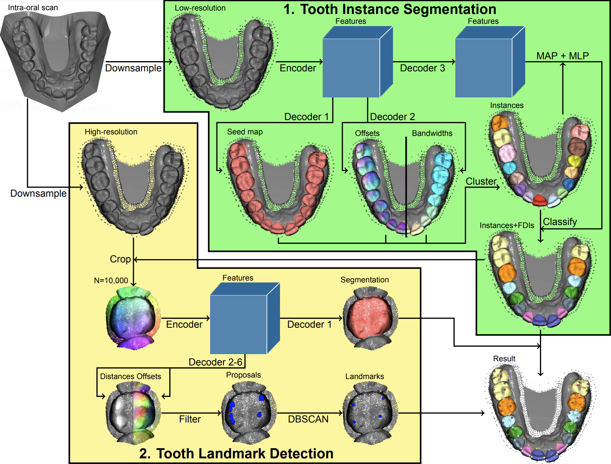

# ToothInstanceNet

Welcome to the repository of our solution to the [3DTeethLand challenge](https://www.synapse.org/Synapse:syn57400900/wiki/).




## Install

First, setup a Conda environment.

``` bash
conda create -n 3dteethland python=3.10
conda activate 3dteethland
```

Then, install the Pip requirements.

``` bash
pip install -r requirements.txt
```

Lastly, compile and install the Cuda kernels.

``` bash
pip install -e -v .
```


## Inference

Please specify the root directory where your scans are stored using the `root` keyword in `teethland/config/config.yaml`. The file names of the scans are expected to contain whether they are of the lower or upper jaw as `STEM_(lower|upper).(stl|ply|obj)`. Please rename the scans using this format to get the correct FDI labels.

Then, download the checkpoints from [here](https://drive.google.com/drive/folders/1MIPNtsM3rW_VAUtD8RBPOso1IxyJZgdF?usp=sharing) and specify their paths using the `checkpoint_path` keywords in `teethland/config/config.yaml`.

Finally, run the model with

``` bash
python infer.py landmarks --devices DEVICES
```

where `DEVICES` can be set to use multiple GPUs for inference. The tooth instance segmentations will be saved next to the scan as `STEM_(lower|upper).json` and the detected landmarks will be saved next to the scan as `STEM_(lower|upper)__kpt.json`.
